# Tatawwu’ — Volunteering in Bahrain

Tatawwu’ brings charitable, volunteer, and humanitarian campaigns in Bahrain into one place. Volunteers can discover activities, save favorites, share campaign links, and track participation. Organizers can publish activities and certificates for the participants after admin review the campaigns.

**Repositories:** [Frontend — React](https://github.com/ctarek2015-wq/tatawuu-frontend) · [Backend — Express and MongoDB](https://github.com/EshaAbbasi/TatawwuBackend)

1. [AAU user stories](#1-aau-user-stories)
2. [Entity relationship diagrams](#2-entity-relationship-diagrams-erds)
3. [Wireframes](#3-wireframes)
4. [Routes](#4-routes)
5. [Component hierarchy](#5-component-hierarchy)

### Getting started

- **Deployed application:**
- **Planning:** [team Trello board](https://trello.com/b/SZ3tg7mp/tatawuu).
- **Frontend repository:** [ctarek2015-wq/tatawuu-frontend](https://github.com/ctarek2015-wq/tatawuu-frontend).
- **Backend repository:** [EshaAbbasi/TatawwuBackend](https://github.com/EshaAbbasi/TatawwuBackend).

#

## 1. AAU user stories

### Visitors

| ID  | User story                                                                                                                                       |
| --- | ------------------------------------------------------------------------------------------------------------------------------------------------ |
| U01 | As a visitor, I want to browse approved volunteering activities in Bahrain so that I can find opportunities to participate.                      |
| U02 | As a visitor, I want to filter campaigns by governorate, area, category, and date so that I can find suitable activities.                        |
| U03 | As a visitor, I want to view campaign images, Bahrain time, venue, and organization information so that I understand an activity before joining. |
| U04 | As a visitor, I want to create a volunteer or organizer account so that I can use the platform.                                                  |
| U05 | As a user, I want to sign in and sign out so that I can securely access my account.                                                              |
| U06 | As a user, I want to edit my name and optional city so that my profile stays accurate.                                                           |
| U07 | As a visitor, I want to copy a public campaign’s link so that I can share the opportunity with others.                                           |
| U08 | As a visitor, I want to open an organization’s public email, phone, or WhatsApp contact link so that I can ask about a campaign.                 |

### Volunteers

| ID  | User story                                                                                                                  |
| --- | --------------------------------------------------------------------------------------------------------------------------- |
| V01 | As a volunteer, I want to register for an available campaign so that I can immediately reserve a place.                     |
| V02 | As a volunteer, I want to cancel before the activity starts so that another person can use my place.                        |
| V03 | As a volunteer, I want to view upcoming and past registrations so that I can track my participation.                        |
| V04 | As a volunteer, I want to see my attendance status so that I know whether my participation was recorded.                    |
| V05 | As a volunteer, I want to preview and download my certificates so that I have a record of my contribution.                  |
| V06 | As a volunteer, I want to save, view, and remove favorite campaigns so that I can return to opportunities that interest me. |

### Organizers

| ID  | User story                                                                                                                                    |
| --- | --------------------------------------------------------------------------------------------------------------------------------------------- |
| O01 | As an organizer, I want to create and edit my Bahrain organization profile so that I can submit it for approval.                              |
| O02 | As an organizer, I want to upload, replace, or remove my organization’s logo so that volunteers can recognize it.                             |
| O03 | As an organizer, I want to create and view campaign drafts so that I can prepare activities in Bahrain.                                       |
| O04 | As an organizer, I want to edit campaign information and its cover image before the activity starts so that the listing stays accurate.       |
| O05 | As an organizer, I want to delete unused unpublished campaigns so that I can remove unnecessary drafts.                                       |
| O06 | As an organizer, I want to submit campaigns for approval and read rejection feedback so that I can get them published.                        |
| O07 | As an organizer, I want to cancel a published campaign so that participants can see that it will not take place.                              |
| O08 | As an organizer, I want to view participants and record attendance after an activity so that participation is documented.                     |
| O09 | As an organizer, I want to complete a campaign after recording attendance so that attendees become eligible for certificates.                 |
| O10 | As an organizer, I want to grant certificates to eligible attendees so that their user IDs are recorded in the campaign’s certificate grants. |

### Admins

| ID  | User story                                                                                                                       |
| --- | -------------------------------------------------------------------------------------------------------------------------------- |
| A01 | As an admin, I want to review organization information, location, and logo so that I can approve Bahrain-based organizations.    |
| A02 | As an admin, I want to review each campaign’s details, location, and image so that I can approve suitable activities in Bahrain. |
| A03 | As an admin, I want to reject or remove inappropriate content with feedback so that organizers understand my decision.           |

## 2. Entity relationship diagrams (ERDs)

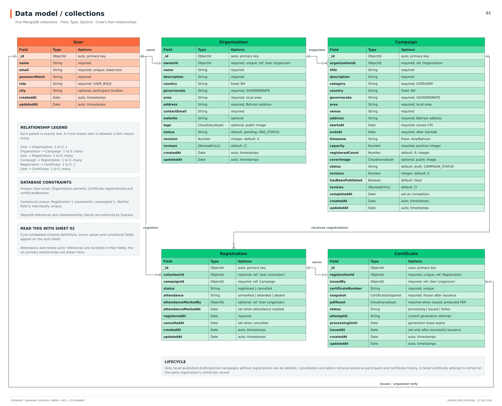

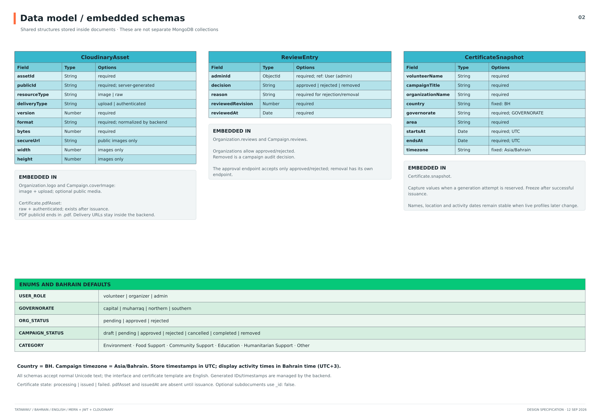

## 3. Wireframes

### Discover activities and view details

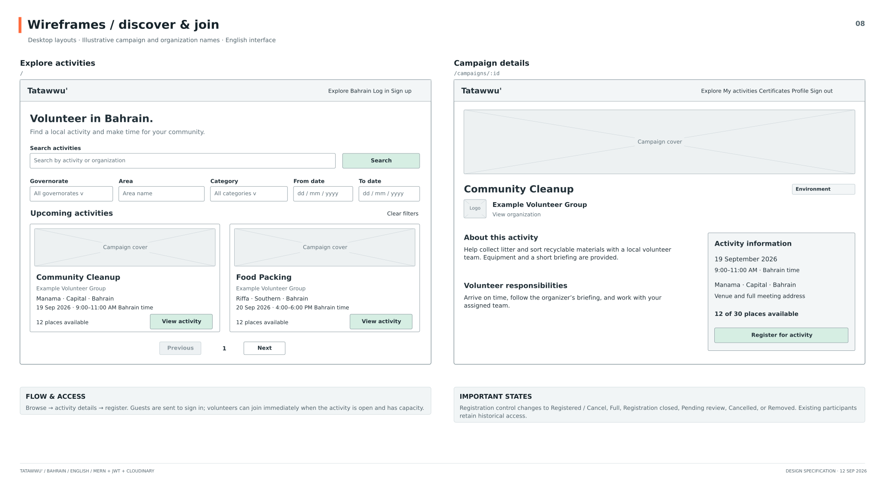

### Signup, login, and profile

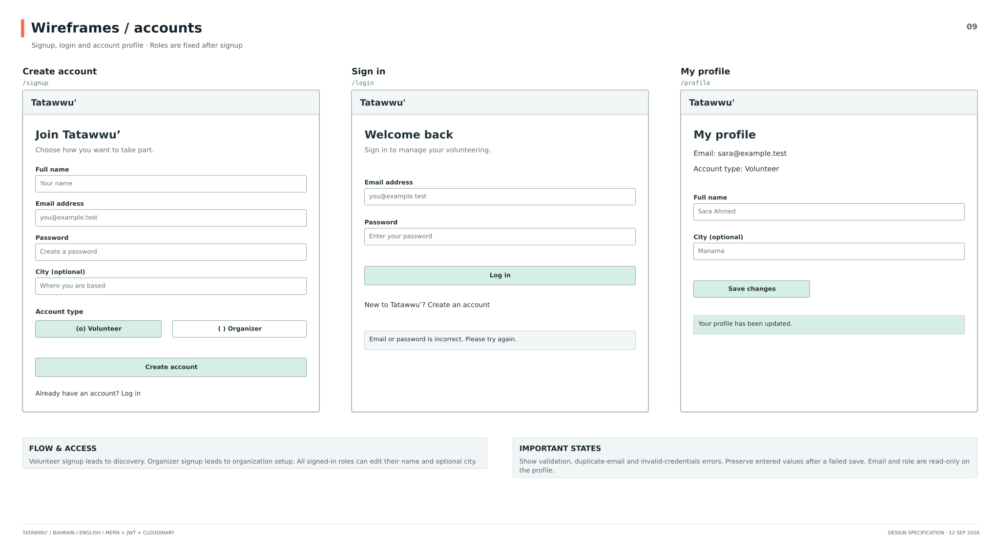

### Organization profile and setup

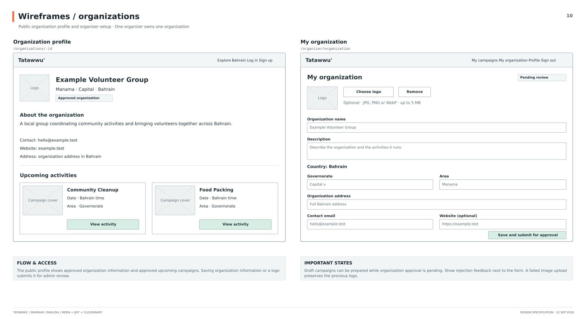

### Organizer dashboard and campaign form

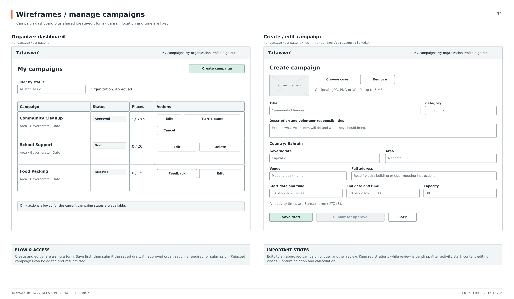

### Participants, attendance, and certificates

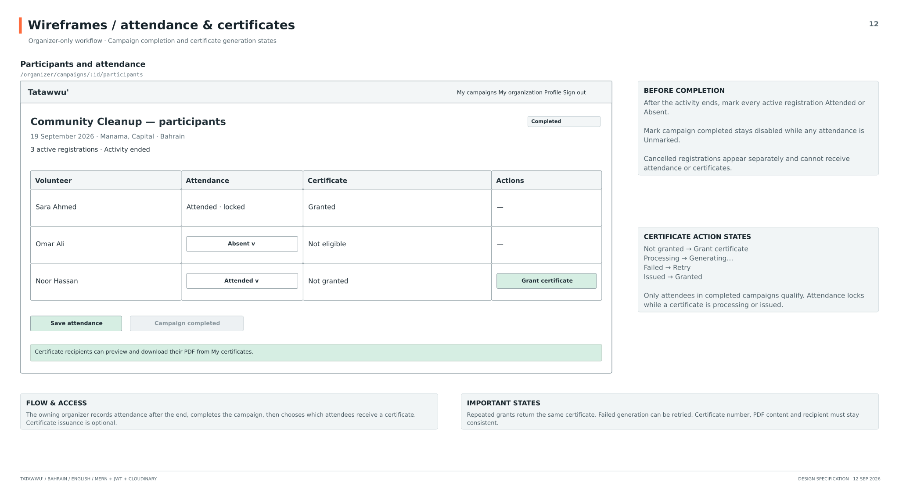

### Volunteer activities and certificates

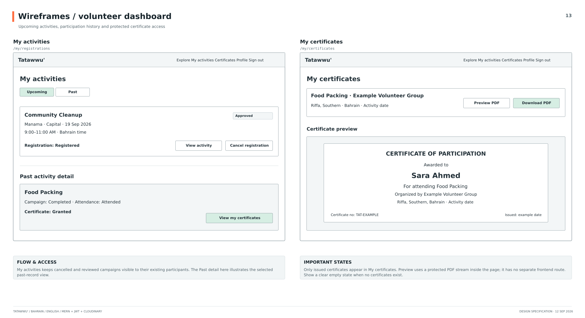

### Admin review

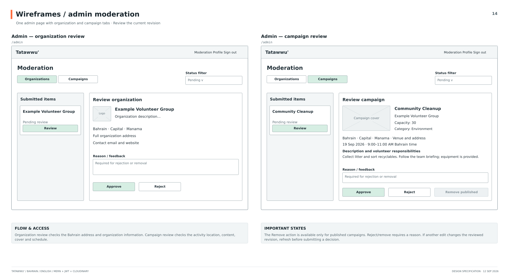

### Mobile behavior and shared states

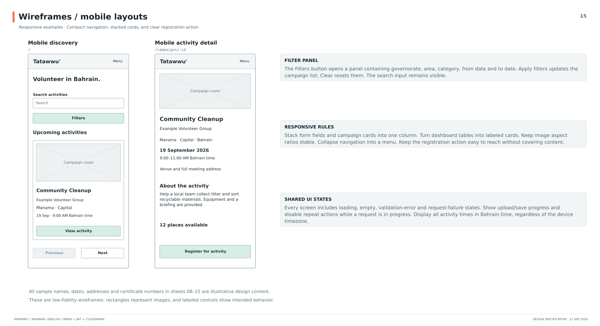

## 4. Routes

### Backend route charts

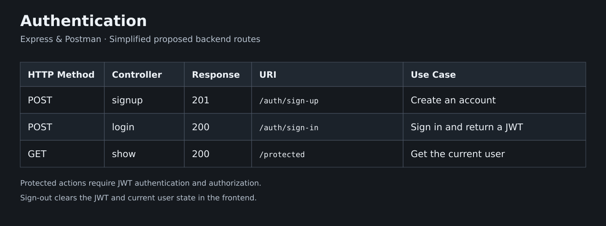

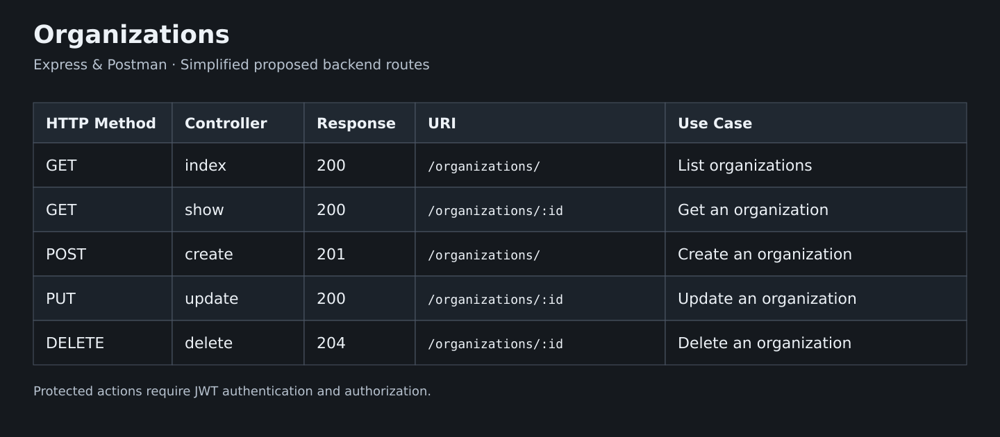

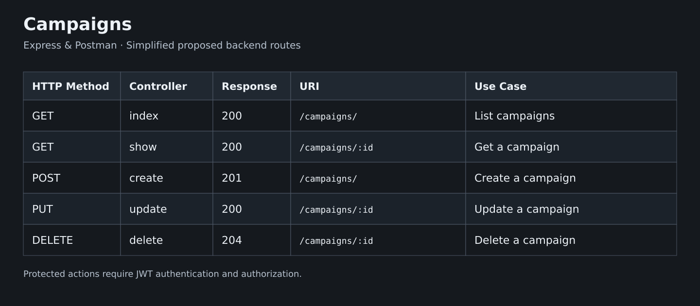

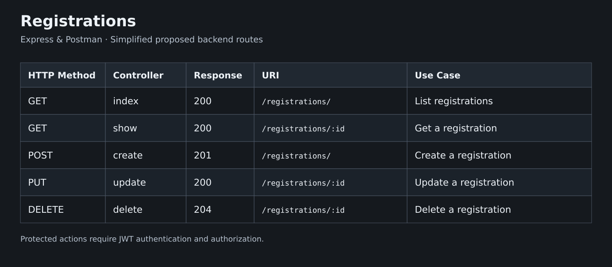

## 5. Component hierarchy

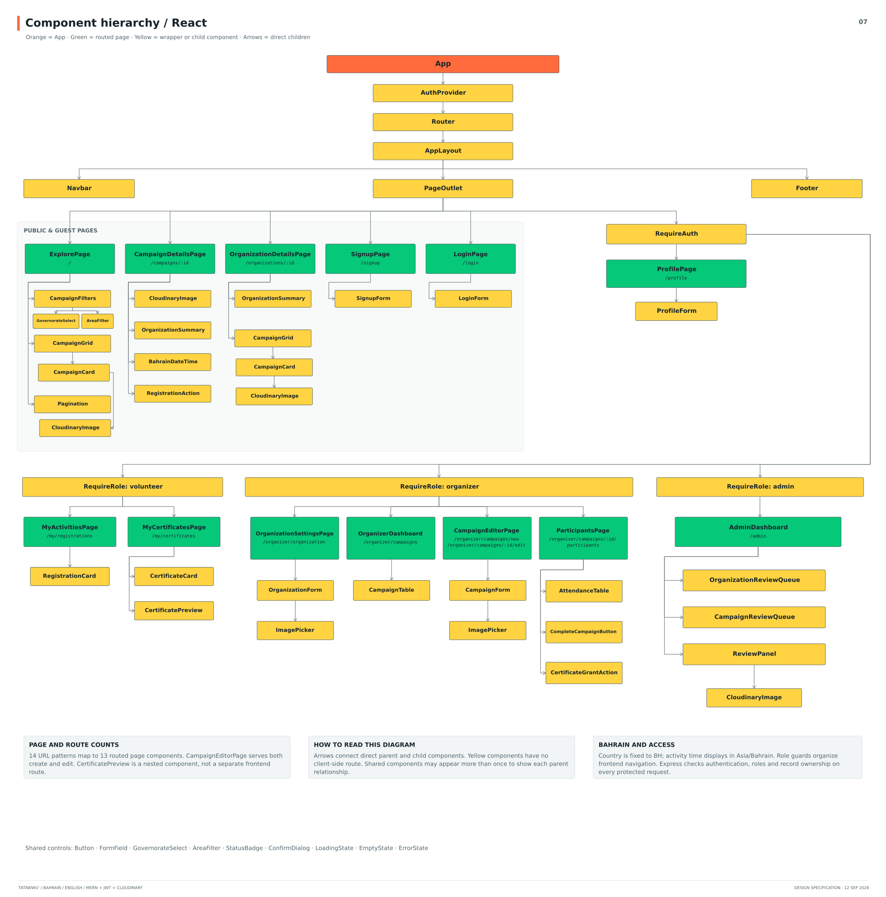

#

### Next steps

- Arabic translation and right-to-left layouts.
- Volunteer badges and a leaderboard with agreed award rules.
- Tracked volunteer hours and automatic certificates after a defined threshold.
- Admin user-management views.

### Technical references

- [MongoDB](https://www.mongodb.com/docs/)
- [Cloudinary](https://cloudinary.com/documentation/)
